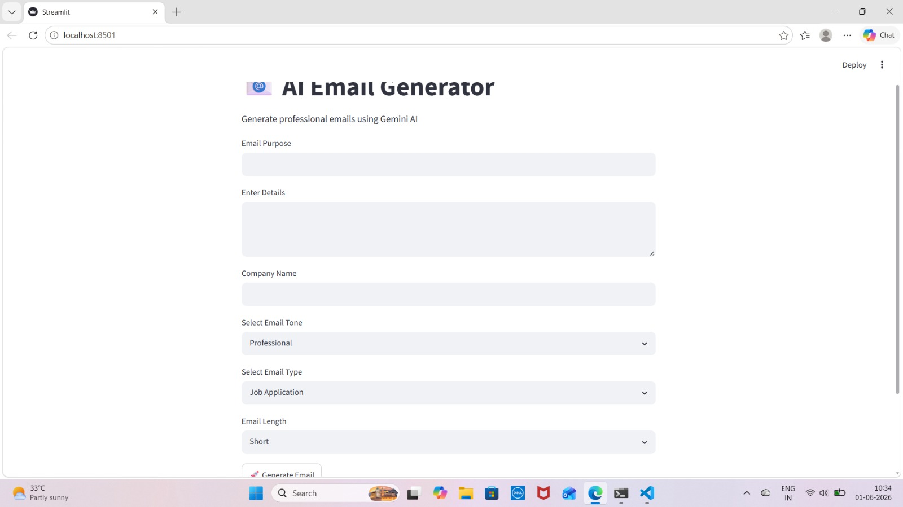
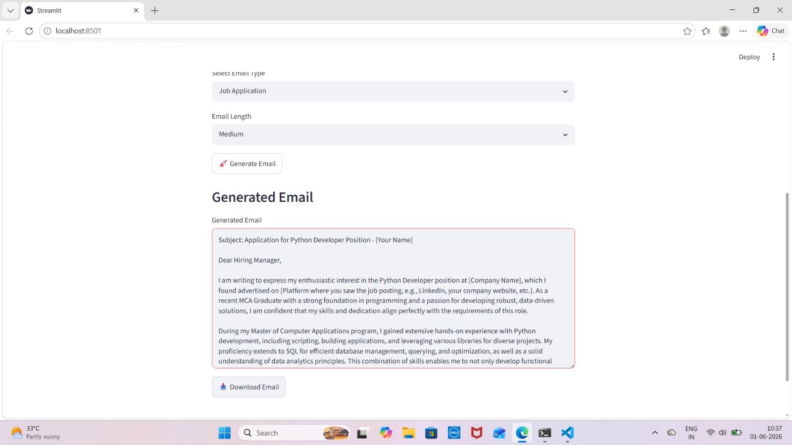

##### AI Email Generator Using Gemini API

## Project Overview

AI Email Generator is an AI-powered web application developed using Python, Streamlit, and Google Gemini API. The application automatically generates professional emails based on user requirements. Users can provide the purpose of the email, company name, email details, preferred tone, and email type, and the system generates a complete professional email within seconds.

## Objective

The objective of this project is to simplify professional email writing by using Artificial Intelligence. Instead of manually drafting emails, users can generate well-structured and professional emails instantly using Gemini AI.

## Key Features

* AI-powered email generation
* Professional and personalized email creation
* Company-specific email generation
* Multiple email types support

  * Job Application
  * Leave Request
  * Internship Request
  * Meeting Request
  * Project Update
* Multiple email tone options

  * Professional
  * Formal
  * Friendly
* Email length customization

  * Short
  * Medium
  * Detailed
* Download generated emails as text files
* Interactive web interface

## Technologies Used

* Python
* Streamlit
* Google Gemini API
* Prompt Engineering

## Application Workflow

### Step 1: User Input

The user enters:

* Email Purpose
* Company Name
* Email Details
* Email Type
* Email Tone
* Email Length

### Step 2: Prompt Creation

The application collects all user inputs and dynamically creates a prompt containing:

* Purpose of the email
* Company information
* Required tone
* Required email format
* Desired email length

### Step 3: AI Processing

The generated prompt is sent to the Google Gemini API. Gemini AI analyzes the request and creates a professional email based on the provided information.

### Step 4: Email Generation

The application displays:

* Subject Line
* Greeting
* Professional Email Body
* Closing Statement

### Step 5: Download Option

Users can download the generated email for future use.

## Screenshots

### Home Page

The home page allows users to enter email details and customize the generated email.

### Generated Email

The generated email page displays a complete AI-generated professional email.

## Example Use Case

### Input

Company Name: Infosys

Email Type: Job Application

Tone: Professional

Purpose: Python Developer Application

Details: MCA Graduate with skills in Python, SQL, and Data Analytics.

### Output

The system generates a professional job application email including:

* Subject
* Greeting
* Professional email content
* Closing message

## Skills Demonstrated

* Python Programming
* API Integration
* Prompt Engineering
* Streamlit Application Development
* AI-Powered Content Generation
* User Interface Development

## Learning Outcomes

Through this project, I gained practical experience in:

* Integrating AI APIs into Python applications
* Building interactive web applications using Streamlit
* Creating dynamic prompts for AI models
* Designing user-friendly interfaces
* Developing real-world AI-powered solutions

## Conclusion

AI Email Generator is a practical AI-based application that automates professional email writing. By combining Python, Streamlit, and Gemini API, the project demonstrates how Artificial Intelligence can be used to improve productivity and simplify communication tasks.
